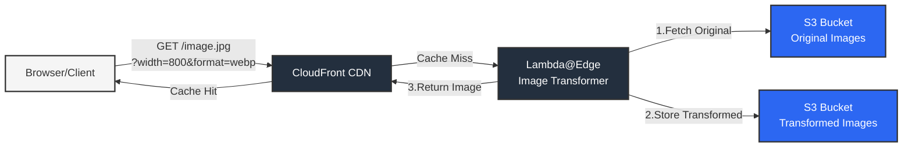

# Dynamic Image Optimization with Amazon CloudFront, AWS Lambda and SST

A serverless image optimization and delivery solution built with SST. This project implements [AWS's reference architecture](https://aws.amazon.com/blogs/networking-and-content-delivery/image-optimization-using-amazon-cloudfront-and-aws-lambda/) for image optimization using CloudFront, Lambda, and S3, providing automatic image transformation, caching, and delivery with minimal operational overhead.

## Key Benefits

- 📦 **Zero Infrastructure Management** - Fully serverless architecture
- 🚀 **Global CDN** - Fast image delivery through CloudFront
- 💰 **Cost-Effective** - Pay only for actual usage
- 🔧 **Simple Integration** - Easy to deploy and integrate

## Features

### Image Transformation
- Resize images by width and/or height
- Support for multiple output formats (JPEG, WebP, AVIF)
- Quality adjustment control

### Performance
- CloudFront edge caching
- Origin Shield support
- S3 persistence for transformed images
- Automatic cache cleanup
- Minimal cold starts

## Architecture

The solution uses three main AWS services:



- **CloudFront** - Content delivery and edge computing
- **Lambda** - Image transformation
- **S3** - Image storage (both original and transformed)

## Quick Start

### Prerequisites

- AWS CLI installed and configured
- Node.js v16 or higher
- SST CLI installed (`npm install -g sst`)
- An AWS account

### Installation

1. Install dependencies:
   ```bash
   bun install
   ```

2. Deploy to AWS:
   ```bash
   NAME=<YOUR_APP_NAME> bun run deploy --stage=<YOUR_STAGE>
   ```

## Usage Guide

### Image Transformation Options

Transform images by adding query parameters to your CloudFront URL:

```plaintext
# Resize by width
https://<distribution>.cloudfront.net/image.jpg?width=800

# Resize by height
https://<distribution>.cloudfront.net/image.jpg?height=500

# Convert format
https://<distribution>.cloudfront.net/image.jpg?format=webp

# Adjust quality
https://<distribution>.cloudfront.net/image.jpg?quality=85

# Combined transformations
https://<distribution>.cloudfront.net/image.jpg?width=800&format=webp&quality=75
```

### Environment Variables

| Variable | Required | Description |
|----------|----------|-------------|
| `NAME` | Yes | Used to name infrastructure that is deployed |

## Development

### Local Testing

Please note that SST live development doesn't work for this project due to Lambda@Edge limitations.

1. Start local development:
   ```bash
   NAME=<YOUR_APP_NAME> bun run dev --stage=<YOUR_STAGE>
   ```

## Contributing

Contributions are welcome! Please read our [Contributing Guide](CONTRIBUTING.md) for details on our code of conduct and the process for submitting pull requests.

## Related Projects

- [AWS Blog Post - Original Architecture](https://aws.amazon.com/blogs/networking-and-content-delivery/image-optimization-using-amazon-cloudfront-and-aws-lambda/)
- [SST Documentation](https://www.sst.dev/)

## License

This project is licensed under the MIT License - see the [LICENSE](LICENSE) file for details.
